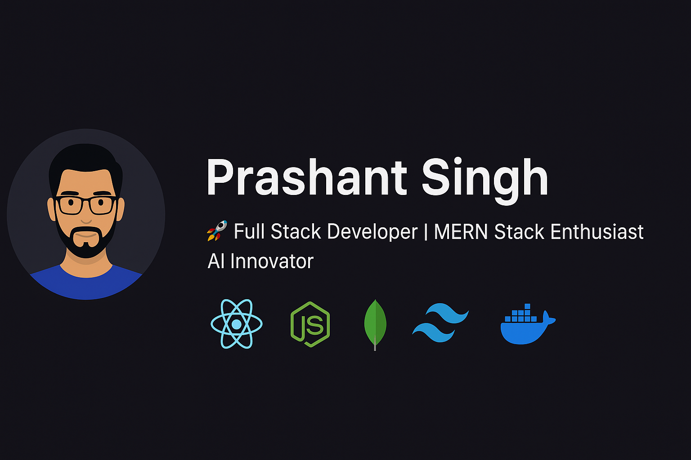

  

<h1 align="center">👋 Hi, I'm Prashant Singh</h1>
<h3 align="center">🚀 Full Stack Developer | MERN Stack Enthusiast | AI Innovator</h3>

  
  

---

### 💡 About Me

I’m a passionate **Full Stack Developer** who enjoys crafting scalable web applications and integrating AI-driven experiences.  
With hands-on experience in both **frontend and backend development**, I focus on performance, security, and real-world usability.  

---

### 🛠️ Tech Stack & Tools

**Frontend:**  
React.js | Next.js | Tailwind CSS | Bootstrap | Daisy UI | Material UI  

**Backend:**  
Node.js | Express.js  | Java | SpringBoot

**Database:**  
MongoDB | Mongoose  | MySql | PostgreSQL 

**Authentication & Security:**  
JWT | Bcrypt  

**Real-time & APIs:**  
Socket.io | REST API  

**Dev Tools & Deployment:**  
Git | GitHub | Vercel | Render | Postman | VS Code  

---

### 🚀 Featured Projects

#### 🍴 [Foody Web – Online Food Ordering System](https://foody-webs.vercel.app/)
A responsive online food ordering platform with integrated payment system.  
**Tech Stack:** MERN | JWT | Razorpay | Bootstrap | Material UI  
- Secure payment using Razorpay  
- Beautiful UI with smooth user experience  
- Hosted on Vercel (frontend) & Render (backend)  
🔗 [GitHub Repository](https://github.com/prashantsingh30/FoodyWeb)

---

#### 💬 [Realtime Chat App](https://github.com/prashantsingh30/Realtime-Chat-App)
A real-time chat application built for instant and seamless communication.  
**Tech Stack:** MERN + Socket.io + Tailwind CSS + Daisy UI  
- Instant real-time messaging  
- Online user status indicator  
- JWT authentication with global state managed by Zustand  
- Deployed on Render  

---

#### 🧠 [AI Career Coach](#)
A Full Stack AI-driven Career Guidance Website that helps users shape their career path.  
**Tech Stack:** MERN | OpenAI API | Tailwind CSS | Flask (AI Backend)  
- AI-powered resume assistance & interview guidance  
- Personalized career insights using LLM  
- Modern UI with responsive design  
- Role-based authentication and secure user data handling  

---

### 🌱 Currently Exploring
- Generative AI & LLM Integration  
- Scalable Web Architecture  
- Advanced DevOps & Cloud Hosting  

---

### 🎯 Goals
- Build innovative **AI-integrated web platforms**  
- Contribute to **open-source MERN and AI projects**  
- Continuously evolve as a **Full Stack Developer**  

---

### 📊 GitHub Stats (Dark Theme)

  
  

  

  

---

### 🤝 Connect With Me

  
  
  

---

### ⚡ Fun Quote
> “Code, Create, Connect — turning imagination into innovation.” 💡

---

⭐ **Thanks for visiting!** Feel free to explore my repositories and connect — let’s build something extraordinary together.
